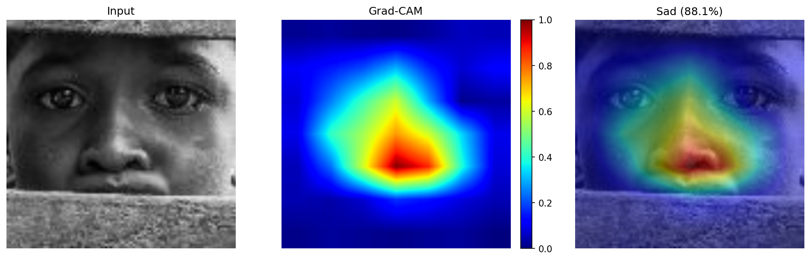
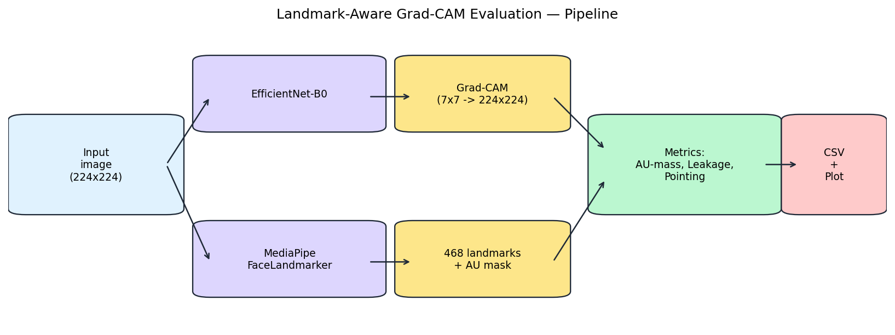
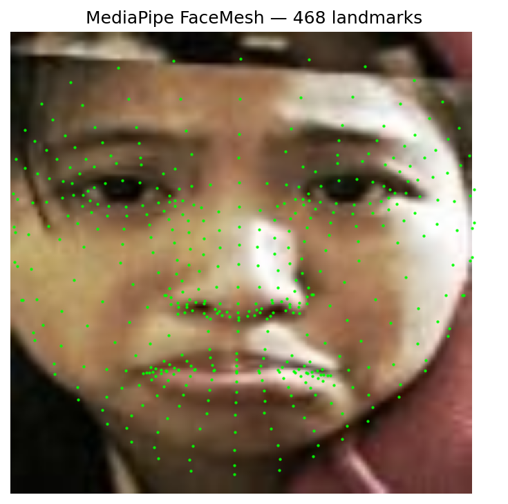
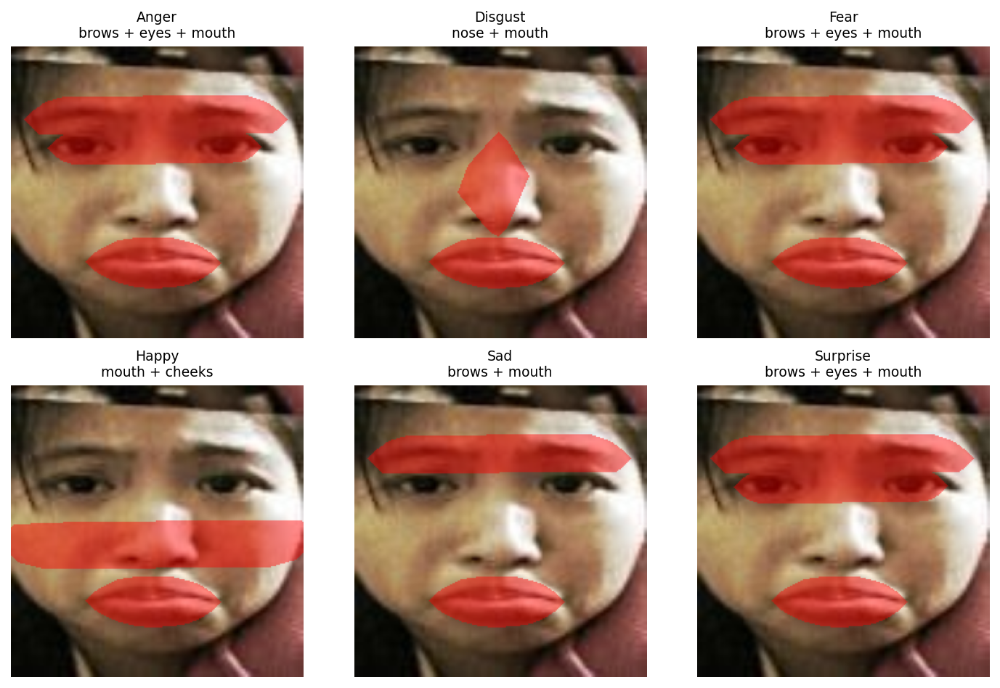
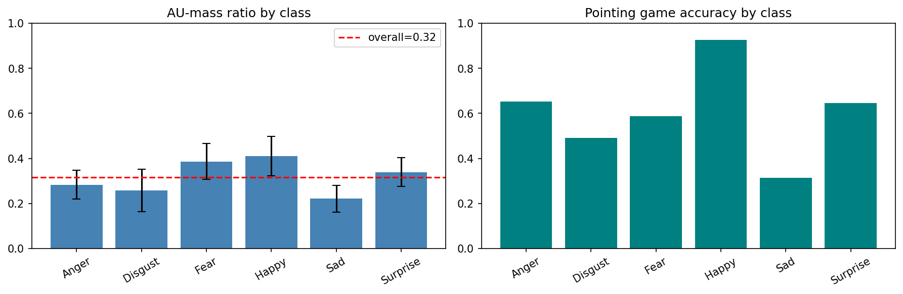
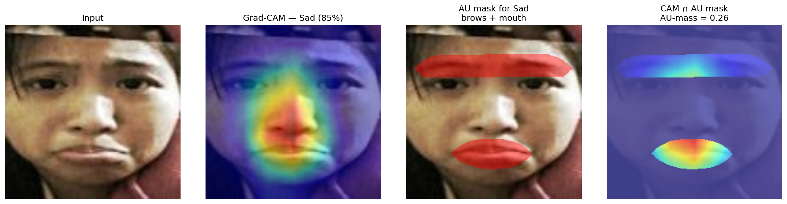

# Introduction: Unveiling the Black Box of Facial Emotion Recognition

Deep CNNs routinely reach 80–85% accuracy on seven-class facial emotion recognition. Accuracy alone, however, tells us nothing about **where on the face** the model looks. For a fine-grained task where emotions differ only in subtle anatomical cues, this matters: a model can be accurate on a test set while relying on spurious background correlations.

**Grad-CAM** — a post-hoc explanation method that turns a trained CNN into a heatmap generator. We implement it from scratch on top of an EfficientNet-B0 fine-tuned on RAF-DB, and use it to probe what the network actually attends to when it predicts each emotion.

We also show: a landmark-aware scoring pipeline that turns the qualitative heatmap into three numerical metrics. It is supplementary — the core of the project is Grad-CAM itself.

## Demystifying Decisions with Post-hoc Explanations

Post-hoc explanation methods are techniques used to interpret and explain the decisions made by a model **after** it has been trained. For convolutional models on images, the most common output is a **heatmap** over the input: high values correspond to regions that took an important role in the network's decision.

Representative methods include **CAM**, **Grad-CAM**, and **FullGrad**. We focus on Grad-CAM because it works on any CNN architecture (no model surgery required) and runs in a single forward + backward pass.

## Fine-Grained Classification: A Case for Explainability

Facial emotion recognition is a fine-grained task: the seven basic emotions share most of the image and differ only in small, anatomically-local cues. This property is both a risk (the model can learn shortcuts in the shared regions) and an opportunity.

---

# Grad-CAM

## From CAM to Grad-CAM

### CAM

**Class Activation Mapping** (Zhou et al., 2016).

1. **Modify the CNN.** Remove FC layers; add a Global Average Pooling (GAP) layer after the last convolutional layer.
2. **Global Average Pooling.** Each feature map is reduced to a single scalar (its spatial mean).
3. **Prediction with a single layer.** The pooled features feed a single FC layer with `num_classes` outputs.
4. **Weights as importance.** The weight $w^c_k$ connecting channel $k$ to class $c$ encodes that channel's importance for that class.
5. **Heatmap.** Compute $\sum_k w^c_k \cdot A^k$, where $A^k$ is feature map $k$. This highlights class-relevant regions.
6. **Visualization.** Upsample to input resolution and overlay.

Limitation: requires the GAP + single-linear-head architecture.

### Grad-CAM

**Gradient-weighted Class Activation Mapping** (Selvaraju et al., ICCV 2017). Applies to any CNN without modification.

1. **Forward pass.** Obtain logit $y^c$ for target class $c$.
2. **Gradient calculation.** Compute $\partial y^c / \partial A^k_{i,j}$ for the last conv layer's feature maps.
3. **ReLU and Global Average Pooling on gradients.** Per-channel weight:

$$
\alpha^c_k = \frac{1}{HW} \sum_{i,j} \frac{\partial y^c}{\partial A^k_{i,j}}
$$

4. **Weighted combination.** Heatmap:

$$
L^c_{\text{Grad-CAM}} = \mathrm{ReLU}\!\left(\sum_k \alpha^c_k \cdot A^k\right)
$$

5. **Normalize and upsample.** Min-max normalize to $[0, 1]$, bilinearly upsample to input resolution.

For EfficientNet-B0 we use `model.features[8]` as the target layer — the final feature block, spatial size $7 \times 7$, 1280 channels. This is the deepest layer that still has spatial structure; going shallower gives sharper but less class-discriminative maps, going deeper loses spatial resolution entirely.

## Project Layout

```
Grad-Cam/
├── config/config.yaml
├── models/best_efficientnet_emotion.pth
├── requirements.txt
└── src/
    ├── dataset/dataset.py                   # RAF-DB HF loader
    ├── models/
    │   ├── efficientemotionnet.py           # EfficientNet-B0 head swap
    │   └── train_efficientnet.py            # training loop
    ├── gradcam/grad_cam.py                  # Grad-CAM class (main component)
    ├── test.py                              # single-image Grad-CAM demo
    └── evaluation/                          # optional add-on (see §Supplementary)
        ├── landmarks.py
        ├── au_masks.py
        ├── metrics.py
        └── run_eval.py
```

## Data Loading

We load RAF-DB from [deanngkl/raf-db-7emotions](https://huggingface.co/datasets/deanngkl/raf-db-7emotions). Labels follow HuggingFace's alphabetical `ClassLabel` order — `['anger', 'disgust', 'fear', 'happiness', 'neutral', 'sadness', 'surprise']`.

```python
# src/dataset/dataset.py (excerpt)
class RAFDBDataset(Dataset):
    def __init__(self, hf_split, transform=None):
        self.hf_split = hf_split
        self.transform = transform
        self.itoc = {
            0: "Anger", 1: "Disgust", 2: "Fear", 3: "Happy",
            4: "Neutral", 5: "Sad", 6: "Surprise",
        }

    def __getitem__(self, idx):
        row = self.hf_split[idx]
        img = row["image"].convert("RGB") if row["image"].mode != "RGB" else row["image"]
        label = int(row["label"])
        if self.transform:
            img = self.transform(img)
        return img, label
```

## Model

EfficientNet-B0 pretrained on ImageNet, first two blocks frozen, classifier head replaced:

```python
# src/models/efficientemotionnet.py
class EfficientEmotionNet(nn.Module):
    def __init__(self, num_classes: int = 7, dropout: float = 0.4):
        super().__init__()
        backbone = models.efficientnet_b0(weights="IMAGENET1K_V1")
        for name, param in backbone.named_parameters():
            if "features.0." in name or "features.1." in name:
                param.requires_grad = False
        in_features = backbone.classifier[1].in_features
        backbone.classifier = nn.Sequential(
            nn.Dropout(p=dropout),
            nn.Linear(in_features, num_classes),
        )
        self.model = backbone

    def forward(self, x):
        return self.model(x)
```

Trained 50 epochs, AdamW, cosine LR schedule, class-balanced cross-entropy with label smoothing, standard augmentation. Final test accuracy ~89%.

## Grad-CAM Implementation

The heart of the project. Forward and backward hooks are registered **once in `__init__`** — registering them per call would leak hooks and make batch evaluation quadratic in the number of images.

```python
# src/gradcam/grad_cam.py
class GradCAM:
    def __init__(self, model: nn.Module, target_layer: nn.Module):
        self.model = model
        self.target_layer = target_layer
        self.gradients = None
        self.activations = None
        self.forward_hook  = target_layer.register_forward_hook(self._save_activation)
        self.backward_hook = target_layer.register_full_backward_hook(self._save_gradient)

    def _save_activation(self, module, input, output):
        self.activations = output.detach()

    def _save_gradient(self, module, grad_input, grad_output):
        self.gradients = grad_output[0].detach()

    def __call__(self, input_tensor, target_class=None):
        self.model.zero_grad()
        output = self.model(input_tensor)
        if target_class is None:
            target_class = output.argmax(dim=1).item()

        one_hot = torch.zeros_like(output)
        one_hot[:, target_class] = 1.0
        output.backward(gradient=one_hot, retain_graph=True)

        weights = torch.mean(self.gradients, dim=(2, 3), keepdim=True)
        cam = torch.sum(weights * self.activations, dim=1).squeeze(0)

        cam = torch.relu(cam)
        cam = cam - torch.min(cam)
        cam = cam / (torch.max(cam) + 1e-8)
        return cam.cpu().numpy()

    def remove_hooks(self):
        self.forward_hook.remove()
        self.backward_hook.remove()
```

Line-by-line:
- `register_forward_hook` captures the target layer's activation $A^k$ after each forward pass.
- `register_full_backward_hook` captures the gradient $\partial y^c / \partial A^k$ flowing into that same layer.
- `one_hot[:, target_class] = 1.0` followed by `output.backward(gradient=one_hot, ...)` triggers backprop with respect to a single class logit — this is what makes the result *class-specific*.
- `torch.mean(self.gradients, dim=(2, 3), keepdim=True)` is the $\alpha^c_k = (1/HW)\sum_{i,j} \partial y^c / \partial A^k_{i,j}$ step.
- `torch.sum(weights * self.activations, dim=1)` is the weighted sum over channels, then `relu → min-max normalize` gives a heatmap in $[0,1]$.

## Single-Image Demo

```python
# src/test.py (core)
model = EfficientEmotionNet(num_classes=7).to(device).eval()
model.load_state_dict(torch.load("models/best_efficientnet_emotion.pth",
                                 map_location=device))

gradcam = GradCAM(model, model.model.features[8])
cam = gradcam(input_tensor, target_class=pred)       # (7,7) in [0,1]
gradcam.remove_hooks()

cam_up = np.array(Image.fromarray((cam*255).astype(np.uint8))
                       .resize((224, 224), Image.BILINEAR)).astype(np.float32)/255
```

Running it on a sample image:

```bash
python src/test.py path/to/face.jpg
```

produces a side-by-side of the input, the raw Grad-CAM heatmap (upsampled), and a 0.55/0.45 blend overlay. This is the primary output of the project — Grad-CAM turned the black-box prediction into a spatial explanation the user can look at.



*Figure 1. Grad-CAM output on a test image. Left: input. Middle: raw 7×7→224×224 heatmap. Right: blended overlay.*

## Running

```bash
# One-time setup
python -m venv .venv && source .venv/bin/activate
pip install -r requirements.txt

# Grad-CAM on one image (the main entry point)
python src/test.py path/to/face.jpg

# Optional quantitative evaluation (see §Supplementary)
python src/evaluation/run_eval.py
```

---

# Supplementary: Quantifying Grad-CAM Quality

## The Challenge of Validating Explanations

Heatmaps are qualitative. A single overlay looks plausible or implausible, but there is no straightforward way to *quantify* whether an explanation is correct. Comparing two explanation methods, or two models, reduces to subjective aesthetics unless we have a ground-truth region of importance per image — which is usually unavailable.

For faces, we can cheat: anatomy is known, and psychology already tells us which regions matter for each emotion.

## Approach: Landmark-Aware Masks from FACS

We build a binary "correct region" mask per image from three off-the-shelf components:

- **MediaPipe FaceLandmarker** — pretrained 468-landmark face detector.
- **FACS / EMFACS** (Ekman & Friesen, 1978) — canonical mapping from each basic emotion to its Action Units and thus to anatomical regions (brows, eyes, nose, mouth, cheeks).
- **Convex hull + binary dilation** — standard CV primitives to convert landmark subsets into region masks.

Given the Grad-CAM heatmap $g(x)$ and the predicted class's region mask $M$, we compute three metrics: AU-mass ratio, background leakage, and pointing game accuracy.



*Figure 2. Supplementary evaluation pipeline. The Grad-CAM branch (top) is the core of the project; the bottom branch is the add-on that turns heatmaps into scores.*

## Metrics

### AU-Mass Ratio

Primary metric. Let $g(x) \in [0,1]^{H \times W}$ be the heatmap and $M \in \{0,1\}^{H \times W}$ the AU-relevant region mask:

$$
\mathrm{AU\text{-}mass}(x) = \frac{\sum_{i,j} g(x)_{i,j} \cdot M_{i,j}}{\sum_{i,j} g(x)_{i,j}}
$$

Bounded in $[0, 1]$, higher is better. A value of 0.41 means 41% of total heatmap energy falls inside the AU-relevant region.

### Background Leakage

Sanity check. With $F$ the full face oval:

$$
\mathrm{Leakage}(x) = \frac{\sum_{i,j} g(x)_{i,j} \cdot (1 - F_{i,j})}{\sum_{i,j} g(x)_{i,j}}
$$

Lower is better. Values above ~20% indicate the model is attending to non-face regions.

### Pointing Game

Discrete version that considers only the heatmap peak:

$$
\mathrm{Pointing}(x) = \mathbb{1}\bigl[\,\arg\max g(x) \in M\,\bigr]
$$

## FACS Table Used

| Emotion | Key AUs | Regions |
|---|---|---|
| Anger | AU4, AU5, AU7, AU23 | brows, eyes, mouth |
| Disgust | AU9, AU15 | nose, mouth |
| Fear | AU1, AU2, AU4, AU5, AU7, AU20 | brows, eyes, mouth |
| Happy | AU6, AU12 | mouth, cheeks |
| Sad | AU1, AU4, AU15 | brows, mouth |
| Surprise | AU1, AU2, AU5, AU26 | brows, eyes, mouth |

## Implementation

Landmarks (MediaPipe Tasks v0.10+ requires an explicit model file; we cache `face_landmarker.task` under `~/.cache/mediapipe/`):

```python
# src/evaluation/landmarks.py (excerpt)
class FaceMeshDetector:
    def __init__(self, model_path=None):
        if model_path is None:
            model_path = Path.home() / ".cache" / "mediapipe" / "face_landmarker.task"
        _ensure_model(model_path)
        options = vision.FaceLandmarkerOptions(
            base_options=BaseOptions(model_asset_path=str(model_path)),
            num_faces=1,
        )
        self._detector = vision.FaceLandmarker.create_from_options(options)

    def detect(self, image_rgb):
        h, w = image_rgb.shape[:2]
        mp_image = mp.Image(image_format=mp.ImageFormat.SRGB, data=image_rgb)
        result = self._detector.detect(mp_image)
        if not result.face_landmarks:
            return None
        lm = result.face_landmarks[0]
        return np.array([[p.x * w, p.y * h] for p in lm[:468]], dtype=np.float32)
```

Mask construction:

```python
# src/evaluation/au_masks.py (excerpt)
# HF label order: 0 Anger, 1 Disgust, 2 Fear, 3 Happy, 4 Neutral, 5 Sad, 6 Surprise.
EMOTION_REGIONS = {
    0: ["brows", "eyes", "mouth"],
    1: ["nose", "mouth"],
    2: ["brows", "eyes", "mouth"],
    3: ["mouth", "cheeks"],
    4: [],
    5: ["brows", "mouth"],
    6: ["brows", "eyes", "mouth"],
}

def _hull_mask(pts, hw):
    mask = np.zeros(hw, dtype=np.uint8)
    hull = cv2.convexHull(pts.astype(np.int32))
    cv2.fillConvexPoly(mask, hull, 1)
    return mask.astype(bool)

def build_emotion_mask(landmarks, emotion_idx, hw, dilate_iters=6):
    regions = EMOTION_REGIONS[emotion_idx]
    if not regions:
        return None
    mask = np.zeros(hw, dtype=bool)
    for name in regions:
        mask |= _hull_mask(landmarks[REGIONS[name]], hw)
    if dilate_iters > 0:
        mask = binary_dilation(mask, iterations=dilate_iters)
    return mask
```

Dilation by 6 pixels compensates for the inherent coarseness of a $7\times7$ Grad-CAM upsampled to $224\times224$ — peaks smear across anatomical boundaries.

Metrics:

```python
# src/evaluation/metrics.py
def au_mass_ratio(cam, region_mask):
    total = cam.sum()
    if total <= 0:
        return 0.0
    return float((cam * region_mask).sum() / total)

def bg_leakage(cam, face_mask):
    total = cam.sum()
    if total <= 0:
        return 0.0
    return float((cam * (~face_mask)).sum() / total)

def pointing_game(cam, region_mask):
    y, x = np.unravel_index(int(np.argmax(cam)), cam.shape)
    return bool(region_mask[y, x])
```

Evaluation loop (wraps Grad-CAM, nothing inside is novel):

```python
# src/evaluation/run_eval.py (core loop)
for i in tqdm(range(n)):
    img_pil, true_label = test_ds[i]
    img_rgb = np.array(display_resize(img_pil))

    input_tensor = val_transform(img_pil).unsqueeze(0).to(device)
    with torch.no_grad():
        pred_label = int(torch.argmax(model(input_tensor), dim=1).item())

    target = int(true_label) if args.use_true_label else pred_label
    if target == NEUTRAL_IDX:
        skipped["neutral"] += 1
        continue

    landmarks = detector.detect(img_rgb)
    if landmarks is None:
        skipped["no_face"] += 1
        continue

    cam_small = gradcam(val_transform(img_pil).unsqueeze(0).to(device), target_class=target)
    cam = _upsample_cam(cam_small, INPUT_SIZE)

    emotion_mask = build_emotion_mask(landmarks, target, (INPUT_SIZE, INPUT_SIZE))
    face_mask    = build_face_mask(landmarks, (INPUT_SIZE, INPUT_SIZE))

    per_class[target]["au_mass" ].append(au_mass_ratio(cam, emotion_mask))
    per_class[target]["leakage" ].append(bg_leakage(cam, face_mask))
    per_class[target]["pointing"].append(float(pointing_game(cam, emotion_mask)))
    per_class[target]["correct" ].append(int(pred_label == int(true_label)))
```



*Figure 3. MediaPipe returns 468 landmarks per face. We group them into five anatomical regions using published topology indices.*



*Figure 4. Per-emotion AU region masks on the same face. "Happy" localizes tightly to mouth + cheeks; "Surprise" spans brows, eyes, and mouth.*

## Results on RAF-DB

Full run on the RAF-DB test split — 1319 images evaluated after skipping Neutral (178) and no-face (198):

| Class    |   n | AU-mass ± σ | Leakage | Pointing | Clf. acc |
|----------|-----|-------------|---------|----------|----------|
| Happy    | 508 | 0.41 ± 0.09 | 0.15    | **0.93** | **0.95** |
| Fear     |  34 | 0.39 ± 0.08 | 0.07    | 0.59     | 0.59     |
| Surprise | 150 | 0.34 ± 0.06 | 0.09    | 0.65     | 0.80     |
| Anger    | 313 | 0.28 ± 0.06 | 0.12    | 0.65     | 0.81     |
| Disgust  | 100 | 0.26 ± 0.09 | 0.05    | 0.49     | 0.55     |
| Sad      | 214 | 0.22 ± 0.06 | 0.11    | 0.31     | 0.81     |
| **OVERALL** | **1319** | **0.32 ± 0.07** | **0.10** | **0.60** | **0.84** |



*Figure 5. AU-mass ratio and pointing accuracy per class.*



*Figure 6. Example inference: input, Grad-CAM overlay, AU region mask (predicted class), and the intersection used to compute AU-mass.*

**Reading the table.**

- **Happy** has the highest AU-mass (0.41), pointing (0.93), and classifier accuracy (0.95) — the Grad-CAM explanation and the classification agree.
- **Disgust** is weak on all metrics (0.26 AU-mass, 0.49 pointing, 0.55 accuracy) — it shares AUs (AU9, AU4) with Anger and is genuinely hard for the classifier.
- **Sad** has 81% classification accuracy but only 31% pointing accuracy: Grad-CAM's peak lies outside the canonical Sad region (brows + mouth) on two-thirds of images. The most likely cause is that the model uses **eyes** (drooping eyelids, averted gaze) as a primary Sad cue — an anatomically valid signal not formally included in AU1 + AU4 + AU15.
- **Overall leakage 0.10** confirms the model is facially grounded: 90% of Grad-CAM's energy lies inside the face.

The numbers are a lens on Grad-CAM's output, not a replacement for it. The per-image overlays remain the primary artifact the project produces.

# Resources

- **Grad-CAM** — Selvaraju et al., ICCV 2017. [arXiv:1610.02391](https://arxiv.org/abs/1610.02391)
- **CAM** — Zhou et al., CVPR 2016. [arXiv:1512.04150](https://arxiv.org/abs/1512.04150)
- **Sanity Checks for Saliency Maps** — Adebayo et al., NeurIPS 2018. [arXiv:1810.03292](https://arxiv.org/abs/1810.03292)
- **FACS** — Ekman & Friesen, *Facial Action Coding System*, 1978.
- **MediaPipe FaceLandmarker** — [developers.google.com/mediapipe/solutions/vision/face_landmarker](https://developers.google.com/mediapipe/solutions/vision/face_landmarker)
- **RAF-DB** — [www.whdeng.cn/raf/model1.html](http://www.whdeng.cn/raf/model1.html); HF mirror: [deanngkl/raf-db-7emotions](https://huggingface.co/datasets/deanngkl/raf-db-7emotions)
